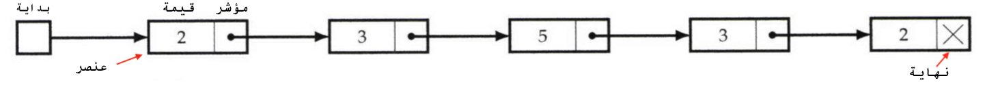

<div dir="rtl" lang="ar">


### القائمة المتصلة (ذات الإتجاه الواحد) "Singly Linked List"





يحتوي كل عنصر في القائمة المتصلة على شيئين، قيمته و مؤشر إلى العنصر التالي
في القائمة.

لبناء قائمة متصلة، نحتاج إنشاء كائنين "classes" الأول لتمثل كل عنصر (يحوي متغيرين: قيمة العنصر الحالي ومؤشر إلى العنصر التالي في القائمة)، والثاني للقائمة المتصلة نفسها. بحيث أن كل قيمة تضاف، هي نسخة من كائن العنصر "Node() instance". يمكننا بناء الكائنين كما يلي:

</div>

```python
class Node:
"""كائن لتمثيل كل عنصر"""

    def __init__(self, val, next_= None):
			# قيمة العنصر 
        self.value = val
			# مؤشر إلى العنصر التالي
        self.next_ = next_
```

```python
class LinkedList:
"""كائن القائمة المتصلة"""

    def __init__(self, head):
        """تبدأ القائمة المتصلة بإضافة العنصر الأول - الرأس """
        self.head = Node(head)

    def add(self, new):
        """لإضافة عنصر جديد إلى القائمة"""
        node = Node(new)
        node.next_ = self.head
        self.head = node

    def __repr__(self, s=[]):
        """لطباعة القائمة"""
        current = self.head
        while current:
            s.append(str(current.value))
            current = current.next_
        return "LinkedList( " + " -> ".join(s[::-1]) + " )"

    def __contains__(self, val):
        """للبحث عن عنصر في القائمة"""
        current = self.head
        while current:
            if current.value == val:
                return True
            current = current.next_
        return False

    def __len__(self):
        """عد العناصر الموجودة في القائمة"""
        count = 0
        current = self.head
        while current:
            count += 1
            current = current.next_
        return count

```

```python
# لتعريف قائمة جديدة، نقوم بإنشاء نسخة من كائن القائمة المتصلة في الأعلى
# ننشئ القائمة مع قيمة ابتدائية وهي العنصر الأول في القائمة
>>> l = LinkedList(4)

# لإضافة عناصر إلى القائمة
>>> for x in [10, 3, 15]:
>>>     l.add(x)

# هل الرقم 33 موجود في القائمة
>>> print(33 in l)
False

# طباعة القائمة الحالية
>>> print(l)
LinkedList( 4 -> 10 -> 3 -> 15 )

# كم عدد يوجد في القائمة الحالية
>>> print(len(l))
4

```
