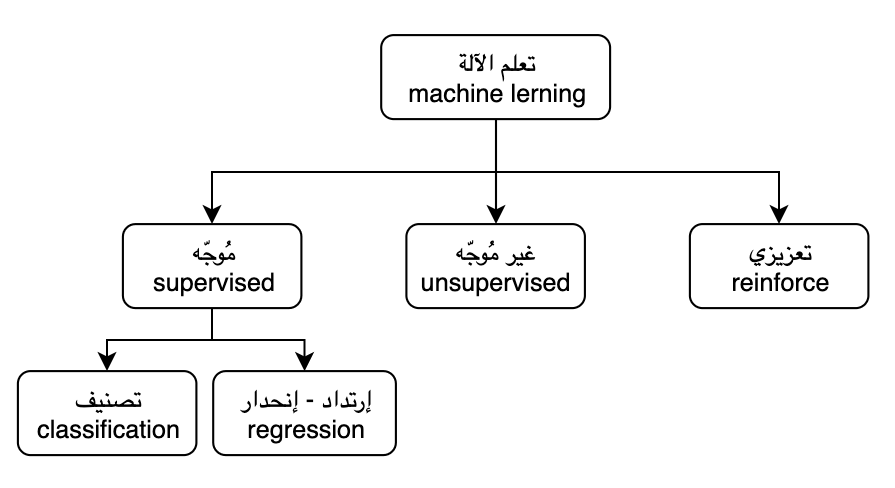

<meta charset="utf-8">

# الموجز في تعلم الآلة

### ماهو تعلم الآلة

نوع جديد من برمجة الكمبيوتر يعتمد على بناءوتطبيق خوارزميات تتيح للآلات "الكمبيوترات" **إستنباط** القوانين ومن ثم **اتخاذ** قرارات بناء على هذه القوانين. (تعريفي الخاص بناء على فهمي للمجال).

<!-- To edit image: /Users/Aziz/Google Drive/draw.io -->

### أنواع تعليم الآلة

### إمثلة

### خلاصة

# مراجع

- [ملخصات عن تعلم الآلة والتعلم العميق](https://github.com/shervinea/cheatsheet-translation/tree/master/ar)
- [أفضل 20 مشروع ذكاء اصطناعي وتعلم الآلة المفتوح المصدر في لغة البايثون
](https://www.threadsnj.com/single-post/top-20-python-ai-and-machine-learning-open-source-projects)

