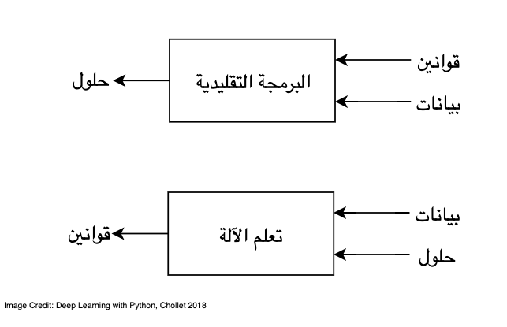
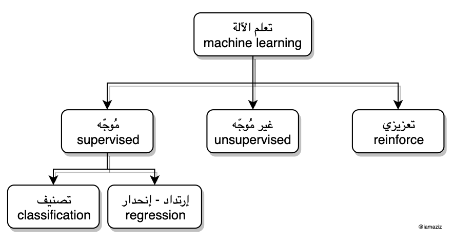

<meta charset="utf-8">

# الموجز في تعلم الآلة

### ماهو تعلم الآلة

نوع جديد من برمجة الكمبيوتر يعتمد على بناءوتطبيق خوارزميات تتيح للآلات "الكمبيوترات" **إستنباط** القوانين ومن ثم **اتخاذ** قرارات بناء على هذه القوانين. (تعريفي الخاص بناء على فهمي للمجال).

<!-- To edit images, open: ./assets/*.drawio with draw.io app -->

<!-- detailed definition -->

ما هو تعلم الآلة أو تعليم الآلة (والذكاء الاصطناعي)؟

الفكرة العامة بشكل مبسط: تمكين الكمبيوتر من التعلم بنفسه بشكل ذاتي.

هو طريقة مختلفة لتصميم وكتابة برامج الكمبيوتر (او بمعنى اصح، خوارزميات الكمبيوتر). والهدف من هذه البرامج "الخوارزميات" هو تمكين الكمبيوتر من تعلم "استنباط" القوانين (بنفسه) التي ينبغي عليه تنفيذها من غير الحاجة لكتابه هذه القوانين من قبل المبرمج.

لتوضيح الفكرة:

تخيل لو أردنا أن نكتب برنامج كمبيوتر يقوم بالمهمة التالية وبشكل آلي: يحمل كتب من موقع انترنت يومياً وبعدها يرتب الكتب على حسب مجالاتها في مجلدات على سطح المكتب. بحيث، كتب الدين في مجلد وكتب العلوم الطبيعية في مجلد آخر ... الخ.  
في البرمجة التقليدية تتطلب اننا نكتب جميع الأوامر (والقوانين) اللي نبغى الكمبيوتر ينفذها وبالتفصيل.
مثلاً، نكتب برنامج مع الأوامر التالية:

افتح الموقع الفلاني -> حمل الكتاب الفلاني

_**"القوانين في البرمجة التقليدية"**_

-> اقرأ نص العنوان (من أسم الملف)، ثم:

-> إذا عنوان الكتاب فيه كلمة "دين" أو "عبادة" حطه في مجلد الدين،

أو

-> إذا عنوان الكتاب فيه كلمة "كيمياء" او "فيزياء" حطه في مجلد العلوم الطبيعية،

أو

-> .. وهكذا

لاحظ ان هذا النوع من البرمجة يتطلب من المبرمج كتابة جميع قوانين الترتيب. الان تخيل معي، على سبيل المثال، لو عنوان أحد الكتب ما يحتوي على كلمة من الكلمات اللي في قوانين الترتيب بالرغم من ان الكتاب ينتمي لكتب الدين، مثلاً العنوان يحتوي على كملة "الشريعة" ولكن المبرمج لم ينتبه لهذا النوع من العناوين. هنا يتطلب ان المبرمج يرجع للبرنامج ويكتب امر او قانون إضافي: إذا العنوان يحتوي على كلمة "الشريعة" حطه في مجلد الدين.
الان توقف، وفكر معي للحظة! ما أكثر الكتب اللي تختلف عناوينها مع انها تتحدث عن نفس المجال!! هل ينبغي على المبرمج انه يحصر ¬¬جميع قوانين الترتيب؟ وكيف؟ .. و و ؟؟ لا شك ان هذي مهمة صعبة ومعقدة. لأن المبرمج ببساطة لا يستطيع ان يحصر جميع المتغيرات اللي تحدد نوع ومجال الكتاب.

من البرمجة التقليدية، إلى تعلم الآلة

الآن، فكر معي، هل من الممكن تصميم برنامج بطريقة أخرى بحيث أن البرنامج يقدر – بشكل ذاتي - انه يستنبط القوانين اللي من خلالها يستطيع التعرف على نوع أو مجال الكتاب؟ الجواب: نعم! تعلم الآلة!!
¬¬في تعلم الآلة، دور المبرمج هو تدريب "تعليم" الكمبيوتر على التعرف على نوع ومجال الكتاب.
مثلاً، في أحد طرق تعلم الآلة، يقوم المبرمج بتصميم برنامج بحيث يعطيه عينات من كتب الدين، وعينات أخرى من كتب العلوم الطبيعية. بعدها يطلب من البرنامج تحليل محتويات العينات والتعرف على نوعية كتب الدين ونوعية كتب العلوم الطبيعية والفرق بينها من خلال العينات المُدخلة. بحيث إذا جاك كتاب جديد تقدر تحكم على نوع ومجال الكتاب بشكل ذاتي.

### أنواع تعلم الآلة

### إمثلة

### خلاصة

# مراجع

- [ملخص لمادة التعلم الآلي CS229 في جامعة ستانفورد](https://stanford.edu/~shervine/l/ar/teaching/cs-229/)
- [ملخصات عن تعلم الآلة والتعلم العميق](https://github.com/shervinea/cheatsheet-translation/tree/master/ar)
- [أفضل 20 مشروع ذكاء اصطناعي وتعلم الآلة المفتوح المصدر في لغة البايثون
](https://www.threadsnj.com/single-post/top-20-python-ai-and-machine-learning-open-source-projects)
- [التعلم العميق باستخدام PyTorch - كورس في جامعة نيويورك](https://atcold.github.io/pytorch-Deep-Learning/ar/)

