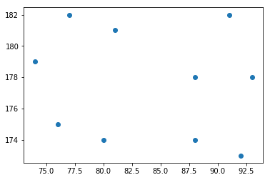
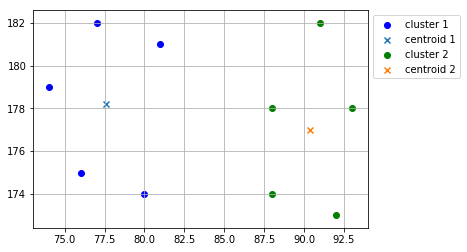
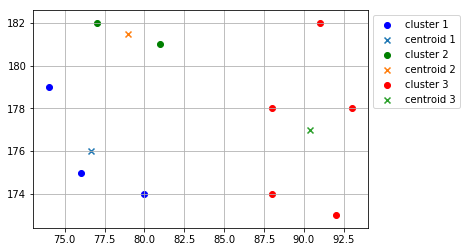

Related tweet:
    https://twitter.com/sassorgsa/status/1138767881192333313

<div dir="rtl" lang="ar">لنفرض ان لدينا بيانات عن جميع سكان مدينة الرياض كـ <b>العمر، الوزن، الطول، اللون</b> (دعنا نسميها بالـ <b>خصائص</b> أو الأبعاد). ونرغب في تقسيم هذه البيانات إلى عدة مجموعات بحيث أن كل مجموعة ستحتوي على أشخاص متشابهين (أي يملكون خصائص مشابهة).</div>
<br>
<div dir="rtl" lang="ar"><b>كيف يمكننا القيام بذلك</b>؟</div>

<div dir="rtl" lang="ar"><b>الجواب</b>: يمكننا استخدام <b>خوارزمية التجميع</b></div>


# <div dir="rtl" lang="ar">شرح خوارزمية التجميع (أو التصنيف) k-means</div>

<div dir="rtl" lang="ar">
تستخدم هذه الخوارزمية كثيراً في مجال تعلم الآلة و علم البيانات لتجميع "تقسيم" نقاط البيانات المتشابهه (المتقاربة) مع بعضها البعض في عدد معين من المجموعات.
</div>

<div dir="rtl" lang="ar">
في هذا الشرح، ولغرض تبسيط المفهوم:
</div>


<div dir="rtl" lang="ar">- سنستخدم عدد صغير من البيانات لشرح كيف تعلم الخوارزمية بالتفصيل.</div>
<div dir="rtl" lang="ar">- سنفترض بيانات وهمية لـ <i>الوزن</i> و <i>الطول</i> لعشرة اشخاص فقط. لاحظ <b>خاصيتين</b> فقط بمعنى كل نقطة في مدخلات البيانات ستحتوي على <b>بعدين</b>. عموماً، تنطبق الخوارزمية على أي عدد من الأبعاد.</div>
<div dir="rtl" lang="ar">- سنقوم بكتابة الخوارزمية من الصفر بدون إستخدام أي مكتبات برمجية جاهزة و حتى بدون إستخدام أي `import` من بايثون.</div>

> <div dir="rtl" lang="ar"> ملاحظة: يمكن للبيانات أن تكون عن أي شي معين و يمكن ان تحتوي على اكثر من بعد او خاصية، مثلاً: بيانات مرضى، أو قياسات درجات حرارة، أو أسعار اسهم، وغيرها
</div>

<hr>

<div dir="rtl" lang="ar">
دعنا أولاً نبداً بـ بيانات الطول و الوزن للعشرة أشخاص، كالتالي: 

</div>


```python
weights = [74, 77, 81, 76, 80, 91, 88, 93, 88, 92]           # الوزن بالكيلوغرام
heights = [179, 182, 181, 175, 174, 182, 178, 178, 174, 173] # الطول بالسنتيمتر
```

<div dir="rtl" lang="ar">
<meta charset="utf-8">

لنصور البيانات بشكل افضل، سنتعرضها في الرسم البياني التالي:
  
</div>


```python
# أمر خاص بالنوتبوك لعرض الرسوم البيانية هنا مباشرة
%matplotlib inline
import matplotlib.pyplot as plt        # نستدعي مكتبة الرسوم البيانية
plt.scatter(weights, heights);         # نعطيها بيانات الطول و الوزن
```





<div dir="rtl" lang="ar">
<meta charset="utf-8">
من اجل تسهيل كتابة الكود، سنضع البيانات في متغير واحد. نسميه الأمثلة. كما يلي:

</div>


```python
samples = [list(point) for point in zip(weights, heights)]
samples
```


    [[74, 179],
     [77, 182],
     [81, 181],
     [76, 175],
     [80, 174],
     [91, 182],
     [88, 178],
     [93, 178],
     [88, 174],
     [92, 173]]


<div dir="rtl" lang="ar">
تحتاج خوارزمية التجميع أن تقوم بحساب المسافات بين النقاط، لذلك فيما يلي، سنكتب دالة لحساب المسافة بين نقطتين ما (وهي المسافة العادية، نفس المسافة الناتجة إذا استخدمنا المسطرة). هذي المسافة تسمى المسافة الإقليدية، ويتم حسابها بين نقطين $U=(u_1, u_2, ...,u_n)$ و $V=(v1, v2, ..., v_n)$ بحيث ان $n$ هو عدد الأبعاد في كل نقطة كما يلي: 
</div>

$$
\sqrt{\left(u_{1}-v_{1}\right)^{2}+\left(u_{2}-v_{2}\right)^{2}+\cdots+\left(u_{n}-v_{n}\right)^{2}}=\sqrt{\sum_{i=1}^{n}\left(u_{i}-v_{i}\right)^{2}}
$$

<div dir="rtl" lang="ar">
فيما يلي دالة بايثون لحساب المسافة:
</div>


```python
def distance(u, v):
    """
    حساب المسافة الإقليدية بين نقطتين
    المسافة = square_root( (u0 - v0)^2 + (u1 - v1)^2) )
    
    u: [int, int], النقطة الأولى
    v: [int, int], النقطة الثانية
    """
    sum_ = sum( (u[i] - v[i])**2 for i in range(len(u)) ) # ناتج الجمع اللي تحت الجذر
    return sum_**(1/2)                                    # نأخذ الجذر للمجموع
```

<div dir="rtl" lang="ar">
سنكتب دالة تأخذ نقطة معينة (لنسميها النقطة الهدف) مع مجموعة نقاط أخرى (لنسميهم نقاط المنتصف)، وترجع النقطة (من نقاط المنتصف) الأقرب إلى النقطة الهدف. كما يلي:

</div>


```python
def get_closer(target, *args):
    """
    حساب أي النقاط اقرب إلى النقطة الهدف
    
    target:  [int, int], النقطة الهدف
    *args: [[int, int]], مجموعة نقاط 
    """
    min_distance = float('inf')
    for point in args:
        d = distance(point, target)
        if d < min_distance:
            min_distance = d
            closer = point
    return closer
```

<div dir="rtl" lang="ar">
<meta charset="utf-8">
سنحتاج دالة أخرى تقوم بحساب نقطة المنتصف لمجموعة من النقاط، نستطيع كتابتها كما يلي:

</div>


```python
def new_centers(*clusters):
    """
    حساب نقطة المنتصف لكل مجموعة من مجاميع المدخلات
    
    clusters: List[List[[int, int]]], قائمة من مجموعات النقاط
    """
    centers = []
    for c in clusters:
        n = max(len(c), 1) # avoid division by 0
        center = [sum(p[0] for p in c) / n, sum(p[1] for p in c) / n]
        centers.append(center)
    return centers
```

<div dir="rtl" lang="ar">
الآن وبعد أن قمنا بكتابة كل الدوال البرمجية التي تحتاجها خوارزمية التجميع، نقوم بكتابة الخوارزمية كالآتي:
</div>


```python
# k-means algorithm 'recursively'
def k_means(data, k=2, *centers):
    """
    خوارزمية التجميع "التصنيف" مع تنفيذ تكراري
    
    
    مع المدخلات التالية
    data: List[List[int]], مجموعة النقاط البيانية التي نرغب في تصنيفها في مجموعات
    k: int, عدد المجموعات التي نرغب بتكوينها
    seeds: List[List[int]], مُدخل إختياري - نقاط المنتصف (المركزية) الإبتدائية لكل مجموعة
    """

    
    # نحدد نقاط المنتصف المبدئية إذا كانت لم تدخل مع البيانات
    # عشوائياً نختار من النقاط الأولى في البيانات (بعدد المجموعات)  كنقاط منتصف أولية
    centers = list(centers) if centers else [data[i] for i in range(k)]
        
    # ننشئ قوائم فارغة لحفظ النقاط التابعة لكل قائمة بها
    clusters = [[] for _ in range(k)]
    
    # نقوم بزيارة جميع النقاط البيانية 
    # ولكل نقطة، سنحسب المسافة بينها وبين نقاط المنتصف  
    for point in data:
        
        # حساب أي نقاط المنتصف أقرب إلى النقطة البيانية الحالية
        nearest = get_closer(point, *centers)
        
        # نسترجع عنوان أو دليل (من بين قائمة نقاط المنتصف) نقطة المنتصف الأقرب للنقطة الحالية
        nearest_cluster_index = centers.index(nearest)
        
        # نضيف النقطة الحالية إلى قائمة المجموعة التي تتبع لها من بين مجموعة القوائم
        clusters[nearest_cluster_index].append(point)

            
    # new centers
    updated_centers = new_centers(*clusters)


    # return when converge
    if centers == updated_centers:
        return clusters, centers

    # if not converge, recurse with new means as the seeds
    print("ITERATION:\n\tstarting centroids: {}\n\tnew centroids: {}".format(centers, updated_centers))
    return k_means(data, k, *updated_centers)
```


```python
# plot and print results
def report_result(centers, clusters):
    colors = ['b', 'g', 'r', 'c', 'm', 'y', 'k', 'w'] # available colors in matplotlib
    n = len(clusters)
    colors = colors[:n]
    for i, clus, cent, col in zip(range(1, n+1), clusters, centers, colors):
        plt.scatter([c[0] for c in clus], [c[1] for c in clus], c=col, label=f"cluster {i}")
        plt.scatter(cent[0], cent[1], marker="x", label=f"centroid {i}")
        
    plt.grid();plt.legend(bbox_to_anchor = (1, 1));plt.show()
```


```python
clusters, centers = k_means(samples, k=2)
report_result(centers, clusters)
```

    ITERATION:
    	starting centroids: [[74, 179], [77, 182]]
    	new centroids: [[76.66666666666667, 176.0], [87.14285714285714, 178.28571428571428]]
    ITERATION:
    	starting centroids: [[76.66666666666667, 176.0], [87.14285714285714, 178.28571428571428]]
    	new centroids: [[77.6, 178.2], [90.4, 177.0]]





<div dir="rtl" lang="ar">
اخيراً، خلنا نجرب نطلع اكثر من مجموعتين. ثلاث مجموعات مثلاً:
</div>


```python
clusters, centers = k_means(samples, k=3)
report_result(centers, clusters)
```

    ITERATION:
    	starting centroids: [[74, 179], [77, 182], [81, 181]]
    	new centroids: [[75.0, 177.0], [77.0, 182.0], [87.57142857142857, 177.14285714285714]]
    ITERATION:
    	starting centroids: [[75.0, 177.0], [77.0, 182.0], [87.57142857142857, 177.14285714285714]]
    	new centroids: [[76.66666666666667, 176.0], [79.0, 181.5], [90.4, 177.0]]





# Try `k_means()` with multiple dimensions


```python
from random import randint
```


```python
def random_point(dimension=3):
    return [rand(40, 100) for _ in range(dimension)]
```


```python
samples = [random_point() for _ in range(100)]
```


```python
clusters, centers = k_means(samples, k=3)
```

    ITERATION:
    	starting centroids: [[42, 100, 61], [90, 62, 79], [49, 67, 80]]
    	new centroids: [[56.5, 90.375], [86.25, 68.84615384615384], [54.03125, 61.28125]]
    ITERATION:
    	starting centroids: [[56.5, 90.375], [86.25, 68.84615384615384], [54.03125, 61.28125]]
    	new centroids: [[58.68181818181818, 90.31818181818181], [86.87755102040816, 68.28571428571429], [54.13793103448276, 57.03448275862069]]
    ITERATION:
    	starting centroids: [[58.68181818181818, 90.31818181818181], [86.87755102040816, 68.28571428571429], [54.13793103448276, 57.03448275862069]]
    	new centroids: [[59.56521739130435, 90.30434782608695], [87.04166666666667, 67.83333333333333], [54.13793103448276, 57.03448275862069]]

